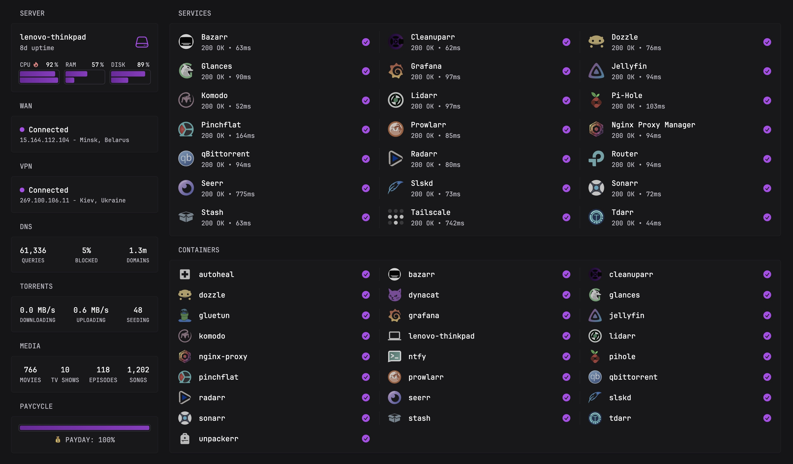

An overengineered media manager



```text
/opt/stacks
├── core/
│   ├── nginx-proxy ............ Reverse proxy
│   ├── ntfy ................... Push notifications
│   └── pihole ................. DNS and adblock
├── ctrl/
│   ├── autoheal ............... Restarts unhealthy containers
│   ├── komodo-core ............ Container manager
│   └── komodo-db .............. Container manager db
├── dash/
│   └── dynacat ................ Dashboard
├── node/
│   └── lenovo-thinkpad ........ Komodo agent
├── stat/
│   ├── cadvisor ............... Docker container resource monitor
│   ├── dozzle ................. Aggregated log viewer
│   ├── glances ................ View of bash top
│   ├── grafana ................ Visualization dashboard for metrics
│   ├── node-exporter .......... Hardware/Host metric exporter
│   └── prometheus ............. Time-series database for metrics
├── tdar/
│   ├── tdarr .................. Transcoder/remuxer
│   └── tdarr-node ............. Transcoder/remuxer node
├── view/
│   ├── jellyfin ............... Media viewer
│   ├── seerr .................. New media discovery
│   └── stash .................. Personal media manager
├── xarr/
│   ├── bazarr ................. Subtitle downloader
│   ├── cleanuparr ............. Unwanted file cleaner
│   ├── flaresolverr ........... Captcha buster
│   ├── lidarr ................. Music download manager
│   ├── pinchflat .............. Youtube video downloader
│   ├── prowlarr ............... Index manager
│   ├── radarr ................. Movie download manager
│   ├── sonarr ................. TV show download manager
│   └── unpackerr .............. Automatic UnRAR
└── xvpn/
    ├── gluetun ................ VPN client
    ├── qbittorrent ............ Torrent client
    └── slskd .................. SoulSeek client
